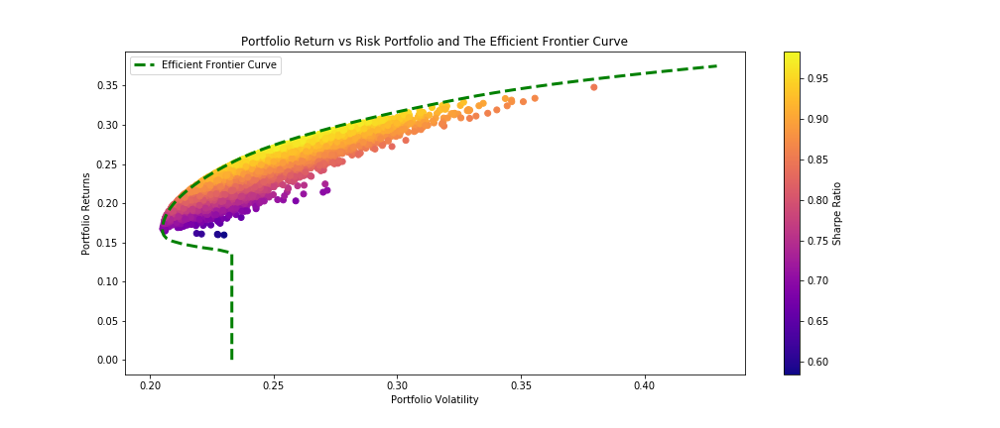
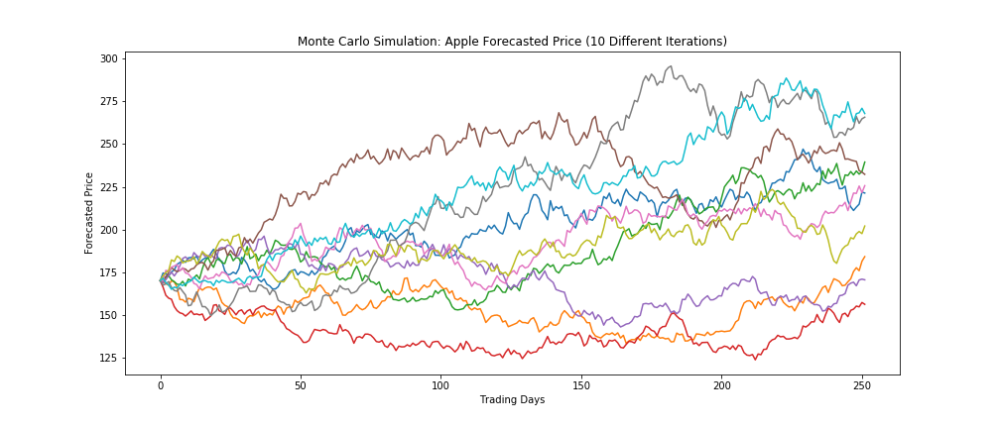
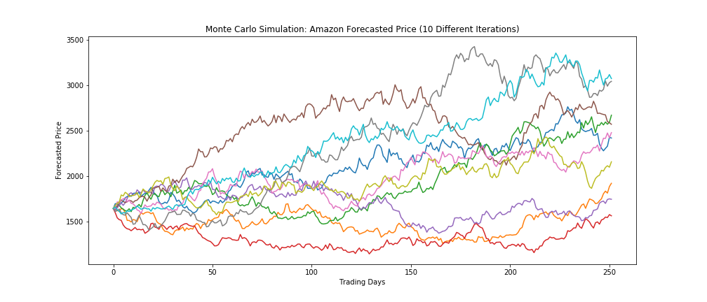
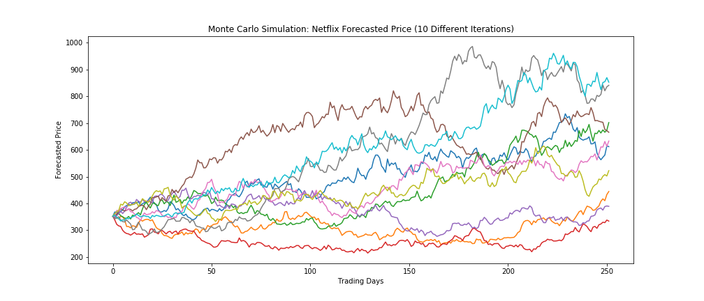

## Technical Analysis of the FAANG Stocks (Facebook, Apple, Amazon, Netflx, Google) and the S&P500

### Getting Started

  Utilizing Python and the Jupyter Notebook, a Technical Analysis of the FAANG Stocks (Facebook, Apple, Amazon, Netflix,
  and Google) was evaluated.

The Python code can be found in the Jupyter Notebook file: [./faang_technical_analysis.ipynb](./faang_technical_analysis.ipynb)

The following Modules were utilized to Quantitate, Analyze and Visualize the Financial Data:
  1. Numpy
  2. Pandas
  3. Matplotlib
  4. Pandas Datareader (Yahoo API)
  5. Scipy

The following analyses were looked at:
  1. The Annualized Return and Risk Profiles:
      - Log Returns & Normalized Returns
      - Volatility & Variability (Standard Deviation/Variance)
      - Correlation
      - Calculating Beta of Stocks
  2. Calculating and Plotting Bollinger Bands of Stocks
  3. Portfolio Allocation and the Cumulative Return of a Portfolio
  4. Calculating the Sharpe Ratio
  5. Calculating Portfolio Optimization:
      - Random Portfolio Allocation
      - Mathematical Optimization #1: Maximum Sharpe Ratio
      - Mathematical Optimization #2: Efficient Frontier Curve
  6. Monte Carlo Simulation: Forecasted Stock Prices

### Assumptions and Notes

The technical analysis are based on the following premises:

  1. Technical Analysis of stocks forecasts future prices based on the historical data and trends. They are limited to
  the dataset in question and does not take into account the fundamentals of the companies, which also
  influences the prices of stocks.
  2. The S&P500 Index (^GSPC) is used as a Benchmark to simulate the Market
  3. The Risk Free Rate is taken to be 2.5%
  4. The Technical Analysis was evaluated using the Data retrieved from 2014-01-02 to 2019-02-13
  5. Between 2014-01-02 to 2019-02-13, the market has been quite bullish with relatively small price corrections
  from time to time. This will influence how the prices are forecasted.
  6. There are approximately 252 Trading Days in a year

### Annualized Return and Risk Profiles

The annualized return and risk of the stocks and the S&P500 are shown in the table below. Evidently, the higher the returns,
the higher the risk. Higher risk investments also display a higher beta value. An investment with a Beta greater than 1 will
generally outperform the market in a bull market but also at the same time fall greater than the market during a bear market.

Ticker | Log Returns | Standard Dev. | Beta |
------------ | ------------- | ------------ | ------------- |
FB | 21.5% | 30.4% | 1.27 |
AAPL | 18.2% | 24.7% | 1.16 |
AMZN | 27.7% | 31.1% | 1.36 |
NFLX | 37.5% | 42.9% | 1.52 |
GOOGL | 13.8% | 23.3% | 1.20 |
^GSPC | 7.68% | 13.3% | 1.00 |

The Beta was calculated using the following formula:
$$ \beta_{i} = \frac{\sigma_{i,m}}{\sigma_{m}^2} $$

The normalized returns of the stocks and the S&P500 is shown in the figure below.

As depicted in the figure above, it can be seen that all FAANG stocks generally trend in the same manner, with each other
and also along with the Market. The higher Beta stocks also tend to rise and fall more drastically compared to the lower beta stocks.

The table below shows that the FAANG stocks are relatively strongly correlated with the S&P500 or the Market, which makes sense, as the FAANG stocks are quite large in market capitalization and are used to make up the S&P500.

Ticker | Correlation
------------ | -------------
FB | 0.56
AAPL | 0.63
AMZN | 0.58
NFLX | 0.47
GOOGL | 0.68
^GSPC | 1.00

### Bollinger Bands of FAANG Stocks

Bollinger bands are volatility bands based on the simple moving average of stock prices. The upper and lower bands are derived from 2 standard deviations over the 20 day simple moving average. The bands will expand as volatility increases and narrow as the volatility decreases. It is used to determine the significance of a price movement and may indicate an oversold stock or an overbought stock.

The Bollinger Bands of the FAANG Stocks are as follows:

### Portfolio Allocation and the Cumulative Return of a Portfolio

An equally allocated portfolio from 2014-01-02 to 2019-02-13 would have yielded a cumulative return of 369.48%.
The gains of the portfolio and stocks are illustrated in the figures below.

### Sharpe Ratio

The Sharpe Ratios were calculated using the following formula:

$$ Sharpe = \frac{{r_{i}} - r_f}{\sigma_{i}} $$

For an equally allocated portfolio, the expected portfolio return is around 25.6% with an expected portfolio volatility of 24.2%. Taking into account the risk free rate of 2.5%, the Sharpe Ratio of an equally allocated portfolio is about 0.9557.

### Portfolio Optimization

The table below shows the results of the different methods of finding the optimum portfolio variables.

Method | Returns | Standard Dev. | Sharpe Ratio |FB Weight |  AAPL Weight | AMZN Weight | NFLX Weight | GOOGL Weight
------------ | ------------- | ------------ | ------------- | ------------ | ------------- | ------------ | ------------- | ------------- |
Equal Allocation | 25.6% | 24.2% | 0.9557 | 0.20 | 0.20 | 0.20 | 0.20 | 0.20 |
Random Allocation | 27.2% | 25.1% | 0.9839 | 0.10 | 0.28 | 0.33 | 0.29 | 0.00 |
Scipy Minimize | 28.1% | 25.7% | 0.9968 | 0.08 | 0.25 | 0.33 | 0.33 | 0.00 |

By randomly allocating thousands of portfolio weights, a close approximation to the optimal portfolio weighting with optimal
results can be measured through guess and check. The random allocation method was simulated 25,000 times and the results
are plotted in the figure below.

Using the Scipy Minimize function (Sequential Least Squares Algorithm), the optimal point of portfolio allocation can be determined. Using the same concept, the Efficient Frontier Curve can be plotted, which plots the highest possible return for a maximum risk an investor is willing to take. Using the Minimize function, the highest possible Sharpe Ratio is 0.9968, with a Expected Return and Volatility of 28.1% and 25.7%.

The Efficient Frontier Curve also known as the Modern Portfolio Theory, is illustrated in the figure below.

### Monte Carlo Simulation: Forecasted Future Stock Prices

In a time series analysis, the Drift Method can be used to forecast future stock prices.

$$ drift = mean - \frac{1}{2} \cdot var $$

$$ r = drift + stdev \cdot z $$

$$ daily\_returns = e^{r} $$

Using the historical stock prices to determine the mean, variance, and the standard deviation, the future stock prices can be forecasted over a randomized normal distribution (Z).

The Monte Carlo Simulation of the FAANG stocks using the Drift Method is illustrated in the figures below.

